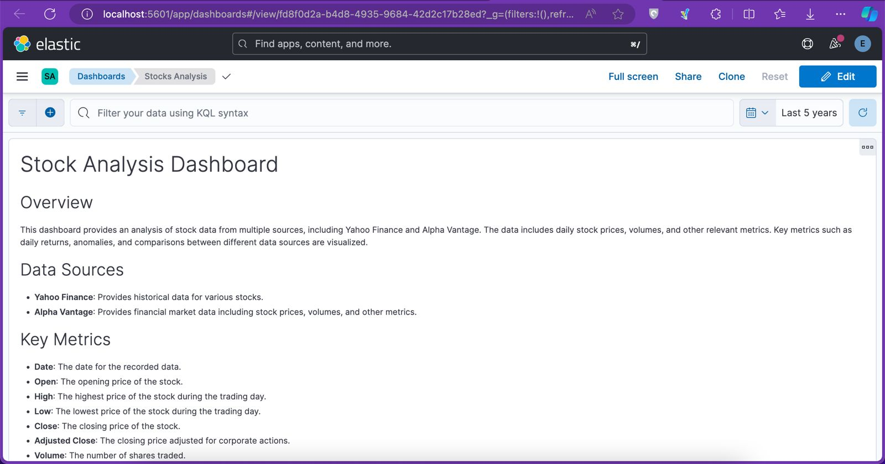
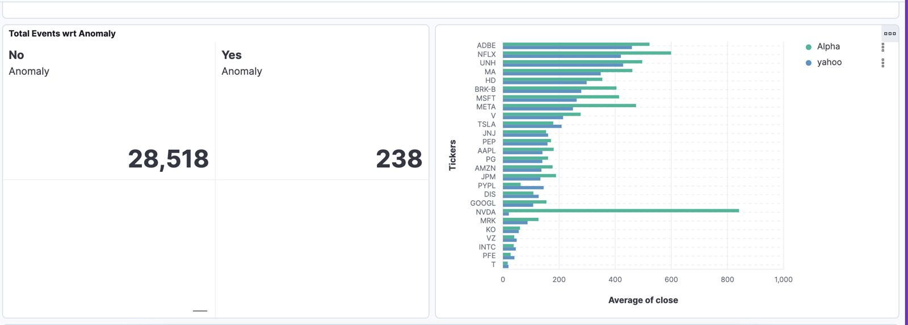
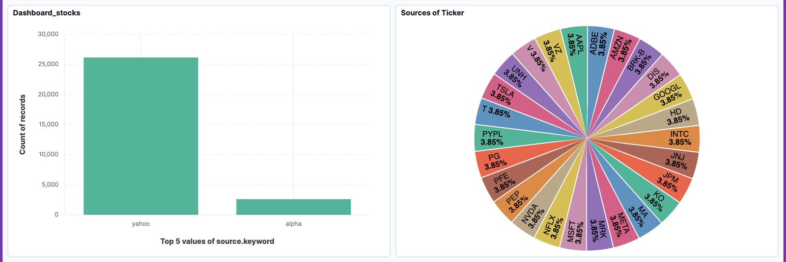
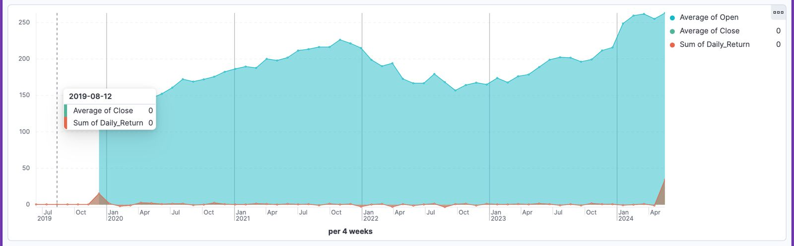
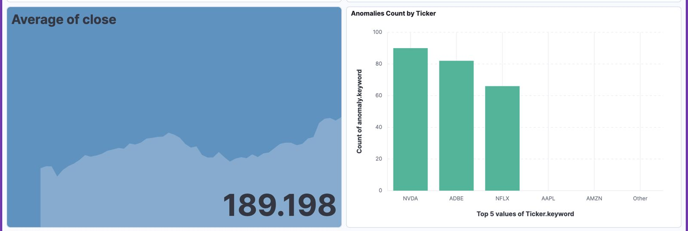
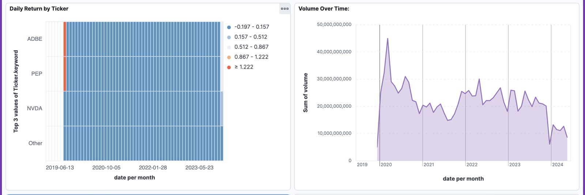
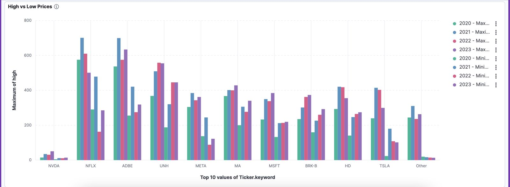
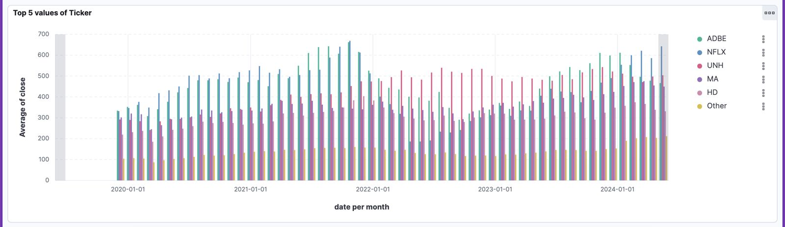

# Stock Data Pipeline with Airflow and Elasticsearch



This project is an automated **ETL pipeline** built using  **Apache Airflow** . It fetches stock data from **Yahoo Finance** and  **Alpha Vantage** , processes the data (including anomaly detection), and indexes the results into **Elasticsearch** for further analysis.

## Table of Contents

* [Overview](#overview)
* [Data Sources](#data-sources)
* [Pipeline Overview](#pipeline-overview)
* [Anomaly Detection](#anomaly-detection)
* [Elasticsearch Integration](#elasticsearch-integration)
* [Setup and Installation](#setup-and-installation)
* [Usage](#usage)
* [Screenshots](#screenshots)
* [License](#license)

## Overview

This project uses Apache Airflow to automate the daily fetching, processing, and storing of stock market data from two main sources:

1. **Yahoo Finance** (via yfinance API)
2. **Alpha Vantage** (via REST API)

The data is processed to detect anomalies (using Z-scores) and stored in Elasticsearch for querying and visualizations.

## Data Sources

### 1. Yahoo Finance

* Ticker symbols are pulled using the `yfinance` library.
* Data includes  **Open** ,  **Close** ,  **High** ,  **Low** , and **Volume** information for each ticker.

### 2. Alpha Vantage

* Daily stock data is pulled using the Alpha Vantage REST API.
* Data includes  **Open** ,  **Close** ,  **High** ,  **Low** , and  **Volume** .

## Pipeline Overview

The DAG consists of the following tasks:

1. **Fetch Yahoo Finance Data** : Download stock data from Yahoo Finance for a given time period.
2. **Fetch Alpha Vantage Data** : Use the Alpha Vantage API to fetch daily stock data.
3. **Process Data** : Clean, transform, and normalize data from both sources. Calculate daily returns, scale prices, and detect anomalies using Z-scores.
4. **Index Data to Elasticsearch** : Index the processed data into Elasticsearch for easy querying.

### DAG Structure

`fetch_yahoo_task >> fetch_alpha_task >> process_data_task >> index_data_task`

### Anomaly Detection

Anomalies are detected by calculating the **Z-score** of the closing prices. Any data point where the Z-score is greater than 3 or less than -3 is flagged as an anomaly. This is useful for identifying extreme price movements that may require further investigation.

## Elasticsearch Integration

The processed stock data is indexed into  **Elasticsearch** , allowing you to search, filter, and analyze the data with powerful full-text search capabilities. Anomalies are highlighted, and historical data can be queried using  **Elasticsearch Kibana** .

## Setup and Installation

### Requirements

1. **Apache Airflow**
2. **Elasticsearch**
3. **Python Packages** :

* `yfinance`
* `requests`
* `pandas`
* `scikit-learn`
* `elasticsearch`
* `numpy`

### Installation

1. Clone this repository:

```
git clone https://github.com/abdullahbh/stock-data-pipeline.git
```

2. Install the required Python packages

```
pip install -r requirements.txt
```

3. Set up **Elasticsearch** locally or use a hosted Elasticsearch instance.
4. Update the **Alpha Vantage API Key** and **Elasticsearch credentials** in the DAG code.
5. Start**Airflow** :
   ```
   airflow scheduler
   airflow webserver
   ```

## Usage

* The pipeline is set to run  **daily** . It fetches the latest stock data, processes it, and updates the Elasticsearch index.
* You can view the DAG and its status in the Airflow web interface.
* The indexed data can be queried from  **Elasticsearch Kibana** .

## Screenshots










### Airflow DAG

## License

This project is licensed under the MIT License. See the [LICENSE]() file for more details.
